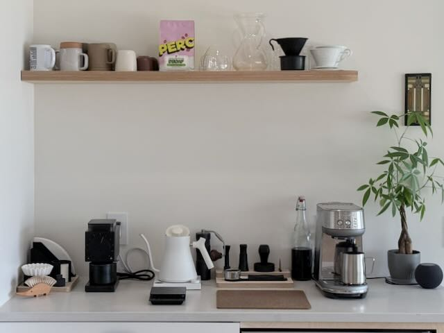

An espresso shot log (not a professional, just tracking so I can go back to what works)[^1]

### Equipment

- [Breville Bambino](https://amzn.to/4aTFyu5)
- [1Zpresso J-Ultra](https://amzn.to/4rnSmiR)
- [Hario V60 Drip Scale](https://amzn.to/4cQ0HrK)
- [Normcore V4 Tamper](https://amzn.to/404nAjD)
- [WDT Tool](https://amzn.to/3NbU5cP)
- [Normcore Puck Screen](https://amzn.to/4smDFgM)
- [Normcore Bottomless Portafilter](https://amzn.to/4u3FosY)
- Custom portafilter funnel
- Custom portafilter tray

---

### Log

**09/10/2025** — [[perc-columbia-huila-decaf|Colombia Huila Decaf]]
- **Grinder:** 1Zpresso J-Ultra @ 1.3.0
- **Dose:** 18g → **Yield:** 32g → **Time:** 28s
- Stopped too soon, but was possibly on target for 30-32s and 36g. Still very sharp and acidic, but not too sour. Not too much channeling.

**03/01/2026** — [[perc-columbia-huila-decaf|Colombia Huila Decaf]]
- **Grinder:** 1Zpresso J-Ultra @ 1.2.5
- **Dose:** 18g → **Yield:** 32g → **Time:** 28s
- Good flow, limited channeling

**03/04/2026** — [[perc-columbia-diego-bermudez-decaf|Colombia Diego Bermudez Decaf]]
- **Grinder:** 1Zpresso J-Ultra @ 1.2.5
- **Dose:** 18g → **Yield:** 43g → **Time:** 23s
- Thin flow, limited channeling.  Good flavor.

**03/15/2026** — [[perc-columbia-diego-bermudez-decaf|Colombia Diego Bermudez Decaf]]
- **Grinder:** 1Zpresso J-Ultra @ 1.1.5
- **Dose:** 18g → **Yield:** g → **Time:** s
- Good flow, limited channeling.  Good flavor.

**03/18/2026** — [[perc-columbia-huila-decaf|Colombia Huila Decaf]]
- **Grinder:** 1Zpresso J-Ultra @ 1.2.5
- **Dose:** 18g → **Yield:** g → **Time:** s
- Thin flow, limited channeling, more sour flavor

[^1]: Some links on this page are affiliate links. I earn a small commission if you purchase through them, at no extra cost to you.
