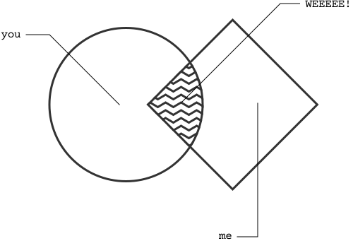

Build to learn. I cut through the chaos to identify the next discrete and logical step to solve any problem. Then I get to work rapidly building solutions to test, informing future steps, and above all... **MAKING PROGRESS.**

I'm a great match when these apply:

- Having trouble getting started...
- Your project is stuck and you need a boost...
- Big dreams, but limited budget...
- You want to fly under-the-radar among giants...

More details coming soon!